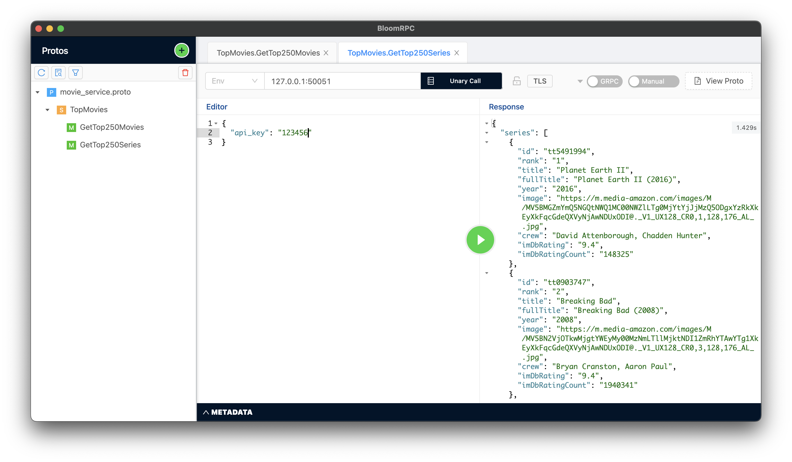

# gRPC Service

using gRPC in Python

## Application

Whenever client send a request, server will process it and send JSON object as response back to the client<br/>

**Responses could be:**
1. Top 250 Movies of IMDB
2. Top 250 Series of IMDB
3. Search Movies by Title
4. Search Series by Title

## Clone Project


```bash
$ sudo apt install git
$ git clone https://github.com/mosihere/imdb_movies
```

## Usage
after cloning project:
you should register in [imdb](https://imdb-api.com/) and take an API-KEY<br>
create an virtual environment,
activate it, install dependencies and done.

```
$ cd imdb_movies
$ python3 -m virtualenv .venv
$ source bin/activate/.venv
$ python -m pip install -r requirements.txt
```

## Running Program
```
first run the Server:
$ python main.py'

use bloomRPC for sending request and getting response on port 50051
127.0.0.1:50051
```

## Build Protocol buffer file:
```
$ python -m grpc_tools.protoc -I. --python_out=. --grpc_python_out=. movie_service.proto
```

## Run UnitTests:
```
$ python -m unittest test.py
```

### Sample response in BloomRPC
<div align="center" >

</div>

### Searching movie by name
<div align="center" >

</div>

## New Features will add soon as a service

## Contributing
Pull requests are welcome.

Please make sure to update tests as appropriate.

## License
[MIT](https://choosealicense.com/licenses/mit/)
